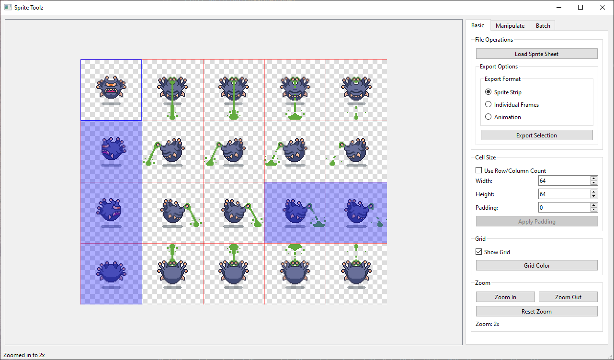
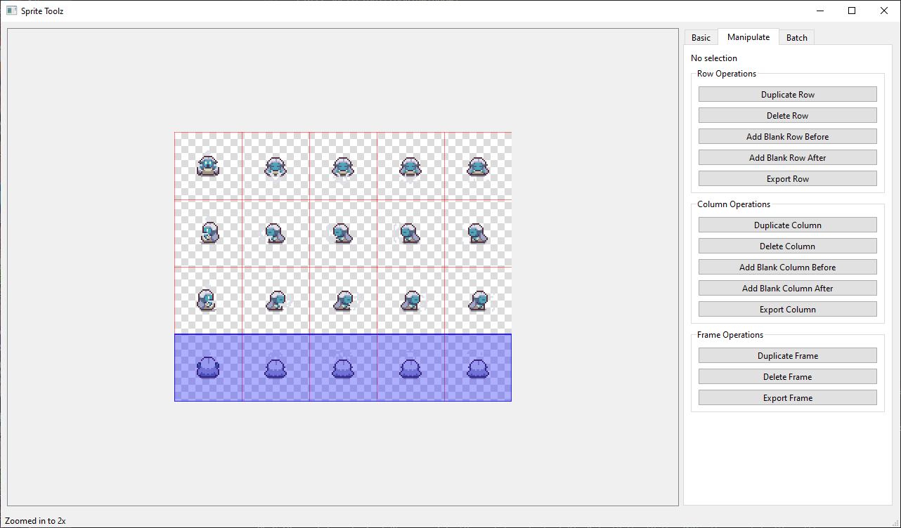
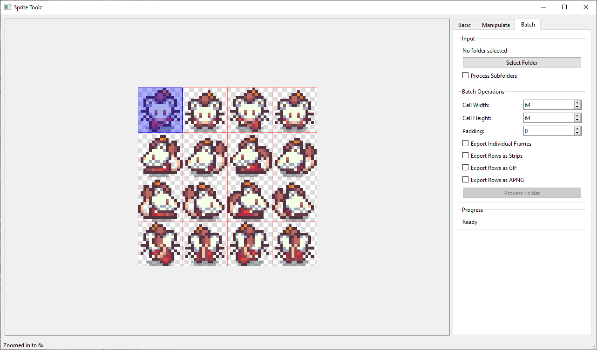

# Sprite Toolz

A powerful sprite sheet manipulation tool built with Python.\
**[Sprite Toolz](https://github.com/non-npc/Sprite-Toolz)** provides a comprehensive set of features for working with sprite sheets, including frame manipulation, batch processing, and animation export.

Read the [Features List](FEATURES.md) for a highlight of features or keep reading:





## Features

### Basic Operations
- **File Operations**
  - Load sprite sheets (supports PNG, JPG, BMP, GIF)
  - Export selections as GIF or APNG animations
  
- **Cell Size Configuration**
  - Two methods for setting cell size:
    - Direct input: Set width and height manually
    - Grid-based: Specify number of rows and columns
  - Toggle between input methods
  - Auto-calculation of complementary values
  - Add padding to cells with live preview
  - Apply padding permanently to resize cells
  
- **Grid Display**
  - Toggle grid visibility
  - Customizable grid color
  - Semi-transparent grid overlay
  
- **Zoom Controls**
  - Multiple zoom levels (1x, 2x, 4x, 6x)
  - Zoom in/out with centered view
  - Reset zoom to default
  - Automatic scrollbars when zoomed

### Sprite Sheet Manipulation
- **Row Operations**
  - Duplicate rows
  - Delete rows
  - Add blank rows before/after
  - Export rows as separate files
  
- **Column Operations**
  - Duplicate columns
  - Delete columns
  - Add blank columns before/after
  - Export columns as separate files
  
- **Frame Operations**
  - Duplicate individual frames
  - Delete frames
  - Export single frames
  
- **Selection Tools**
  - Select individual frames (Click)
  - Select entire rows (Shift + Click)
  - Select entire columns (Ctrl + Click)
  - Select multiple frames by dragging
  - Custom frame selection (Ctrl + Shift + Click)
    - Select frames in any order from any row/column
    - Click selected frame again to remove from selection
    - Export selected frames as strip or animation
  - Export selections as PNG/GIF/APNG animations

### Batch Processing
- **Input Options**
  - Process entire folders of sprite sheets
  - Optional subfolder processing
  - Supports multiple image formats
  
- **Batch Operations**
  - Set cell dimensions for all files
  - Apply padding to all sprites
  - Export options:
    - Individual frames as PNG
    - Rows as sprite strips
    - Rows as GIF animations
    - Rows as APNG animations
  
- **Output Organization**
  - Creates organized output in "processed" folder
  - Maintains folder structure when processing subfolders
  - Clear progress tracking and status updates

## Usage Tips
- Use Shift+Click to select entire rows
- Use Ctrl+Click to select entire columns
- Click and drag to select multiple frames
- Preview padding changes before applying them
- Use the batch processing feature for multiple files
- Export animations in either GIF or APNG format
- Customize grid color for better visibility

## Interface
- Three main tabs for organized access to features:
  1. **Basic**: Core operations and display settings
  2. **Manipulate**: Row, column, and frame manipulation tools
  3. **Batch**: Bulk processing operations
- Transparent sprite support with checkered background
- Real-time status updates
- Progress tracking for batch operations

## Requirements
- Python 3.x
- PyQt6
- Pillow (PIL)
- NumPy
- imageio

## Installation
1. Ensure Python 3.x is installed
2. Install required packages:
```bash
pip install PyQt6 Pillow numpy imageio
```
3. Run the application:
```bash
python sprite_toolz.py
```


## Output Formats
- **PNG**: Individual frames and sprite strips
- **GIF**: Animated sequences with customizable frame duration
- **APNG**: (Animated PNG) High-quality animations with transparency support

## Notes
- All operations preserve transparency
- GIF exports include proper frame disposal for clean animations
- APNG (Animated PNG) exports maintain full color depth and alpha channel
- Batch processing creates organized subfolders for different export types 

Read the [Features List](FEATURES.md) for a highlight of features
